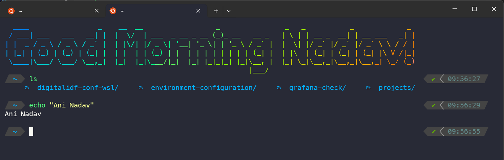
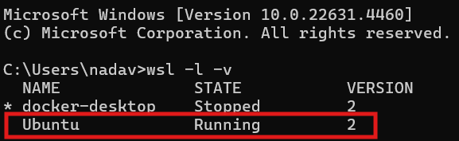

# Environment Configuration

## WSL
WSL (short for Windows Subsystem for Linux) is a virtualization solution that allows you to easily install a Linux VM.  
WSL is not mandatory, and you can use any operating system you prefer.  
The configuration can be a bit complex, so the DevOps team has created a tool to configure it for you.  
The tool will install a variety of plugins, libraries, and essential tools to make your life easier, including:  
K9S, Homebrew, Docker, common-fate/granted, and more.  
Additionally, it will automatically configure the following files for you:
```
~/.aws/config
~/.kube/config
```

## Downloads
### First step - Downloading WSL
To install WSL, first try running the command `wsl --install` in the CMD.  
If that doesn’t work, Google will be your best friend for the next steps.  
Once you’ve successfully installed it, run the command `wsl -l -v` to verify the installation.

> [!NOTE]
> It is very important that WSL is version 2!
### Second step - Downloading Windows Terminal
Download the Windows [Terminal application](https://apps.microsoft.com/detail/9n0dx20hk701?rtc=1&hl=he-il&gl=IL), an amazing tool with a sleek design and convenient for CLI.  
You can now access the terminal by searching for "Terminal" in the search bar or by:  
**WinKey + R**, then typing `wt`.
### Third step - Downloading fonts
Download all the fonts from [this](https://github.com/romkatv/dotfiles-public/tree/master/.local/share/fonts/NerdFonts) repository.  
After that, open each one and click "Install" (there should be four of them).

## Configure
### First step - Downloading oh-my-zsh
Enter WSL by opening the terminal and run the following commands:
```
sudo apt update
sudo apt install zsh
sh -c "$(curl -fsSL https://raw.githubusercontent.com/ohmyzsh/ohmyzsh/master/tools/install.sh)"
```
### Second step - Configure Githab
Run the following commands:
```
sudo apt install gh
gh auth login
```
### Third step - Downloading code and files
>[!NOTE]
>We are about to run a script that will configure WSL, and it may take a long time (approximately 10 minutes). If something goes wrong during the process, you can rerun it.
Run the following commands:
```
git clone https://github.com/NadavOren05/environment-configuration.git
cd digitalidf-conf-wsl
chmod +x configure_my_wsl.sh
./configure_my_wsl.sh
```
### Fourth step - customizing
Now comes the fun part—the part where you design your theme! Run the command in a new shell.
```
p10k configure
```
### Updating permissions
If your permissions have been updated for new environments, you can run the following code:
```
cd digitalidf-conf-wsl
chmod +x config-aws-kube.sh
./config-aws-kube.sh
```